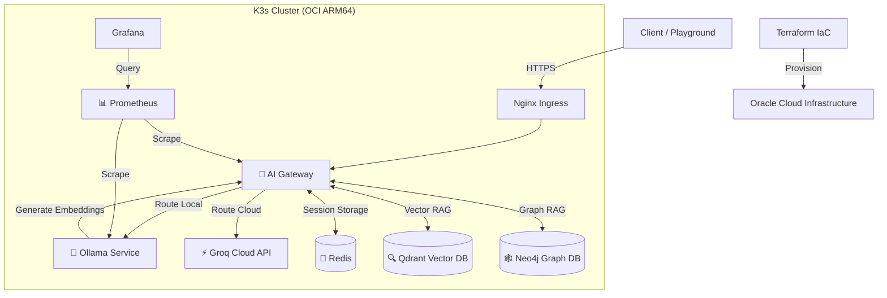

# 🧪 AI Infra Lab

[](terraform/)
[](k8s/)
[](apps/ai-gateway/)
[](https://chat.zyklab.me)

**AI Infra Lab** es un entorno de ingeniería de producción diseñado para desplegar, orquestar y escalar cargas de trabajo de Inteligencia Artificial. Este proyecto implementa una arquitectura híbrida (Edge/Cloud) sobre Kubernetes, gestionando todo el ciclo de vida desde la infraestructura como código (IaC) hasta la observabilidad avanzada.

## 🚀 Live Demo
* **AI Playground:** [https://zyklab.me](https://zyklab.me) - Interfaz de chat con memoria y soporte multi-modelo.
* **Grafana Dashboards:** [https://grafana.zyklab.me](https://grafana.zyklab.me) - Monitoreo de tokens, latencia y recursos.

---

## 🏗 Arquitectura del Sistema

El sistema está construido sobre una instancia **ARM64 (Ampere A1)** en Oracle Cloud Infrastructure (OCI), aprovechando la eficiencia de la arquitectura ARM para ejecutar modelos de lenguaje.



### Componentes Principales

#### 1. [🤖 AI Gateway (Go)](apps/ai-gateway/)
El núcleo inteligente del sistema. Un API Gateway desarrollado en Go siguiendo arquitectura hexagonal.
* **Smart Routing:** Decide dinámicamente si usar Ollama (local) o Groq (cloud).
* **Memory Management:** Mantiene el contexto de las conversaciones usando Redis.
* **Hybrid RAG (Retrieval-Augmented Generation):**
  * **Vector RAG:** Ingesta de documentos con vectorización automática (nomic-embed-text) y búsqueda semántica en Qdrant.
  * **GraphRAG:** Extracción automática de entidades y relaciones usando LLM, almacenadas en Neo4j para búsqueda estructurada por keywords.
* **Safety & Resilience:** Implementa *Circuit Breakers*, *Safety Breaks* y *Summarization* automática de contexto.

#### 2. [🦙 Ollama Service](services/ollama/)
Despliegue contenerizado de Ollama optimizado para ARM64. Provee inferencia local privada para modelos como Llama 3 o Mistral.

#### 3. [🧪 AI Playground](apps/playground/)
Frontend ligero para interactuar con el Gateway. Soporta sesiones persistentes, streaming de tokens (SSE) y selección de proveedores.

#### 4. [☁️ Infraestructura (Terraform)](terraform/)
Definición declarativa de la infraestructura en OCI. Gestiona VCNs, Subnets, Security Lists y la instancia de cómputo Compute Ampere.

---

## 🛠 Stack Tecnológico

| Capa | Tecnología | Uso |
| :--- | :--- | :--- |
| **Cloud** | Oracle Cloud (OCI) | Infraestructura física (ARM64). |
| **IaC** | Terraform | Aprovisionamiento de recursos. |
| **Orquestación** | K3s (Kubernetes) | Gestión de contenedores liviana. |
| **Backend** | Go (Golang) | Lógica de negocio de alto rendimiento. |
| **Inferencia** | Ollama / Groq | Motores de LLM Local y Cloud. |
| **Vector Store** | Qdrant | Base de datos vectorial para RAG semántico. |
| **Graph Store** | Neo4j | Base de datos de grafos para GraphRAG. |
| **Session Store** | Redis | Almacenamiento de sesiones y jobs. |
| **Observabilidad** | Prometheus / Grafana | Métricas de negocio y sistema. |
| **Ingress** | Nginx / Cert-Manager | Gestión de tráfico y SSL automático (Let's Encrypt). |

---

## 📂 Estructura del Repositorio

```bash
.
├── apps/
│   ├── ai-gateway/    # Código fuente del Gateway en Go (Hexagonal Arch)
│   └── playground/    # Frontend estático para pruebas de chat
├── k8s/
│   ├── services/
│   │   ├── neo4j/     # Base de datos de grafos para GraphRAG
│   │   ├── ollama/    # Manifiestos K8s para el motor de inferencia local
│   │   ├── qdrant/    # Base de datos vectorial para RAG semántico
│   │   └── redis/     # Cache y almacenamiento de sesiones
│   └── ...            # Namespaces, Ingress, Certs
├── terraform/         # Scripts de infraestructura OCI
└── README.md          # Este archivo
```

## 🚦 Primeros Pasos

Para replicar esta infraestructura:

1.  **Infraestructura:** Ir a `terraform/` y ejecutar `terraform apply` para crear la VM en Oracle Cloud.
2.  **Kubernetes:** Configurar `~/.kube/config` con el acceso al cluster K3s.
3.  **Dependencias:** Desplegar Redis y Namespaces desde `k8s/`.
4.  **Aplicaciones:** Desplegar el Gateway y Playground usando los manifiestos en `apps/`.

---

> **Autor:** Iván Grzegorczyk
